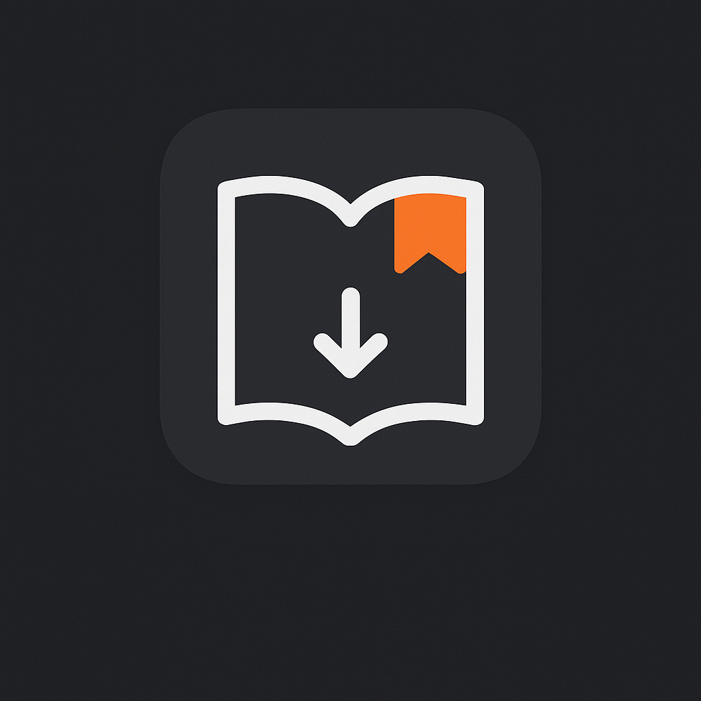

# NoteGrab 🚀

**Умный менеджер заметок и учебных материалов**



## 📖 О проекте

NoteGrab - это десктопное приложение для организации учебного процесса, созданное с помощью Electron. Оно объединяет в себе функционал заметок, планировщика задач и библиотеки учебных материалов.

## ✨ Возможности

### 🎯 Основные модули
- **📝 Умные заметки** - Создание и организация заметок с тегами и поиском
- **🗓️ Планировщик** - Управление задачами и расписанием занятий
- **📚 Библиотека** - Хранение и категоризация учебных материалов
- **🎓 Учебные материалы** - Доступ к курсам, книгам и статьям

### 🎨 Интерфейс
- **Адаптивный сайдбар** с компактным и полным режимами
- **Темная тема** с акцентными цветами
- **Быстрый доступ** к часто используемым функциям
- **Визуальные иконки** для интуитивной навигации

## 🛠 Технологии

- **Frontend:** HTML5, CSS3, JavaScript (ES6+)
- **Фреймворк:** Electron
- **Стили:** CSS Grid, Flexbox, CSS transitions
- **Хранение:** LocalStorage, файловая система

## 📦 Установка и запуск

### Предварительные требования
- Node.js (версия 16 или выше)
- npm или yarn

### Установка
```bash
# Клонирование репозитория
git clone https://github.com/yaroslav-belov101/NoteGrab.git

# Переход в директорию проекта
cd NoteGrab

# Установка зависимостей
npm install